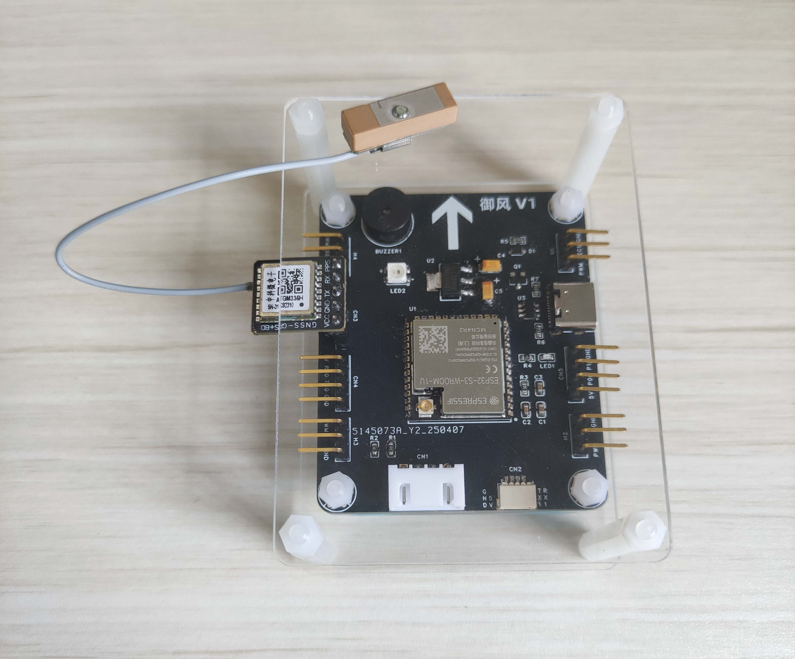

# 御风

### 介绍
这是开源飞控项目 **御风** 的软件实现，主控芯片为ESP32-S3，开发环境为 VScode + ESP-IDF。

### 软件架构
软件的实现基于双核 SMP FreeRTOS，也就是ESP-IDF FreeRTOS，飞控能通过集成的 WIFI 进行无线调试与遥控，上位机有手机端和电脑端。

### 目标
实现基本的遥控飞行与自动飞行，也可以在飞控上验证一些控制算法或传感器数据融合算法，适合的飞行平台为小中大型四旋翼飞行器。

### 进度
目前已完成一部分测试，之后将陆续更新进一步的测试结果和代码。

### 硬件
飞控板开源地址：https://oshwhub.com/qingshisong/yufeng

 
